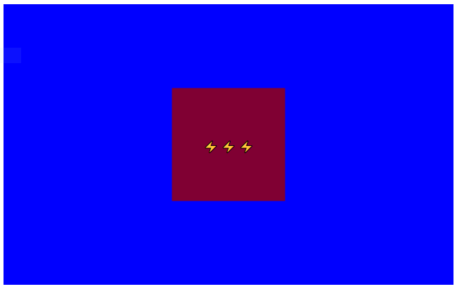

# ⚡ WebGL Lightning
A project to render dynamic lightning in WebGL.

# Progress So Far #

Yes. It's still a square. But I will get there one day :)

# How to view
Simply go to [this link](http://htmlpreview.github.io/?https://github.com/Thisura98/webgl-lightning/blob/master/index.html)